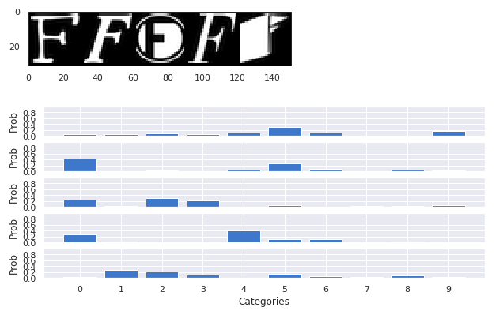

# Pratical Sampling-based Bayesian Inference for multimodal distribution

Pytorch implementation of "Pratical Sampling-based Bayesian Inference for multimodal distribution" <br>

## Prerequisites
* Python 3.6
* Pytorch 0.4.0
* tensorboardX 1.6

## Usage

### Toy Example
There are two implementation, one is for toy example and the other is for training model with MNIST dataset. <br>
for toy example, you can follow `toy_test.ipynb` notebook file. <br>
Our algorithm efficiently searches modes that are far from each other. The result of the toy example can be seen below


### MNIST Example
* **Train** <br>
for training model with MNIST dataset, you can run the code by
```
python main_mnist.py --gpu_number=0 --lr=1e-2 --bs=200 --threshold=0.333 --noise_pow=-0.25
```
tensorboard can be seen in `./runs/lr0.01_bs200_th0.333_pow-0.25/log/` directory. <br>
 <br>

* **Test** <br>
you can see the experiment with the 60 saved models in `experiment_mnist.ipynb` notebook file. <br>
our model can express uncertainty when tested in different dataset such as fashionMNIST and notMNIST.
#### MNIST

#### fashionMNIST

#### notMNIST

